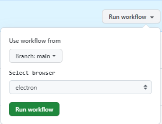
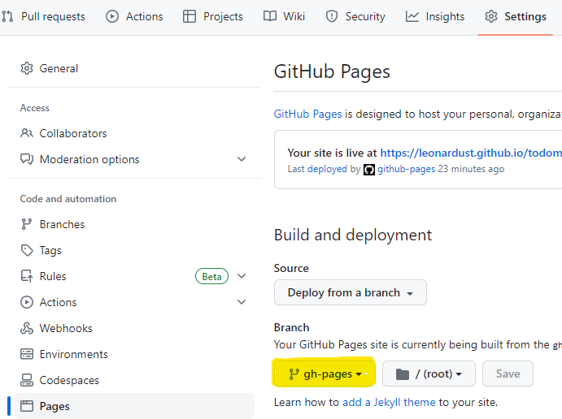
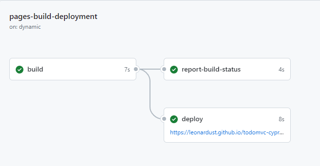

# Github Actions

Create folder **workflows** inside of **.github**

### Create basic.yml

```yaml
name: End-to-end tests
on: push
jobs:
  cypress-run:
    runs-on: ubuntu-22.04
    steps:
      - name: Clear npm cache
        run: npm cache clean --force
      - name: Setup Node
        uses: actions/setup-node@v3
        with:
          node-version: 16.x
      - name: Checkout
        uses: actions/checkout@v3
      # Install npm dependencies, cache them correctly
      # and run all Cypress tests
      - name: Cypress run
        uses: cypress-io/github-action@v5
        with:
          install-command: npm install
          build: npm run build
          start: npm start

```

`install-command: npm install` is used to install devDependencies

### Cucumber reports

Add steps to **generate report** and **upload artifacts** after **Cypress run** step.

```yaml
      - name: Generate report
        if: always()
        continue-on-error: true
        run: npm run cy:report
      - name: Upload report
        if: always()
        uses: actions/upload-artifact@v3
        with:
          name: cypress-cucumber-report
          path: cypress/reports/cucumber-report/

```

Piece of code below preserves that next steps are always execute even **Cypress run** step fails

```yaml
    if: always()
    continue-on-error: true

```

### Workflow job parametrization



#### workflow_dispatch

To enable triggering jobs manually from github actions add to basic.yml file in __on:__ section. Pure workflow_dispatch allow to trigger job with one default branch parameter set to main.

```yaml
on: [workflow_dispatch, push]
```

#### inputs

To enable browser selection modify basic.yaml file in **on:** section by adding inputs browser in type choice

```yaml
on:
workflow_dispatch:
  inputs:
    browser:
      type: choice
        description: Select browser
        default: electron
        options:
          - electron
          - chrome
          - firefox
          - edge

push:
  branches: [main]

```

#### env

add **env:** section to set browser env variable based on the user selection or default

```yaml
env:
BROWSER: ${{ github.event.inputs.browser || 'electron' }}

```

add browser option in **Cypress run** step to run tests in selected browser

```yaml
    - name: Cypress run
      uses: cypress-io/github-action@v5
      with:
        browser: ${{env.BROWSER || 'electron'}}
        install-command: npm install
        build: npm run build
        start: npm start

```

#### cron

to schedule jobs add to **on:** section

```yaml
  schedule:
  - cron: "0 0 * * *"

```

### Deploy report to gh-pages

We can deploy report to gh-pages branch where artifact from last run will be stored performing steps below:

add step __deploy report to gh-pages__ [How GITHUB_TOKEN works](https://dev.to/github/the-githubtoken-in-github-actions-how-it-works-change-permissions-customizations-3cgp)

```yaml
    - name: deploy report to gh-pages
      if: always()
      uses: peaceiris/actions-gh-pages@v3
      with:
        github_token: ${{ secrets.GITHUB_TOKEN }}
        publish_dir: ./cypress/reports/cucumber-report

```

add write permissions

```yaml
jobs:
  cypress-run:
    runs-on: ubuntu-22.04
    permissions:
      contents: write

```

set gh-pages as branch from which Github Page will be deployed



For now our workflow file will trigger pages-build-deplyment job which deploy report from cucumber tests to github pages



### Workflow Summary

We can configure workflow file to display in job summary custom information like: browser or link to the report page

```yaml

  - name: Write summary
    if: always()
      run: |
      echo "[View run in Cucumber Report](https://leonardust.github.io/todomvc-cypress-cucumber/)" >> $GITHUB_STEP_SUMMARY

```


### Cucumber for jira

To provide integration with Cucumber for Jira plugin:

add step to workflow file

```yaml
      - name: Push results to jira
        if: always()
        run: |
          curl -X POST https://c4j.cucumber.io/ci/rest/api/results \
          -H "authorization: Bearer ${{ secrets.C4J_TOKEN }}" \
          -H 'content-type: multipart/form-data' \
          -F results_file=@./cypress/reports/cucumber-json/cucumber-report.json \
          -F language=js

```

create repository secret C4J_TOKEN with value provided by Cucumber for Jira plugin in your Jira instance

### Final workflow

```yaml
name: End-to-end tests
on:
  schedule:
    - cron: "0 0 * * *"
  workflow_dispatch:
    inputs:
      browser:
        type: choice
        description: Select browser
        default: chrome
        options:
          - electron
          - chrome
          - firefox
          - edge

  push:
    branches: [main]

env:
  BROWSER: ${{ github.event.inputs.browser || 'chrome' }}

jobs:
  cypress-run:
    runs-on: ubuntu-22.04
    permissions:
      contents: write
    steps:
      - name: Clear npm cache
        run: npm cache clean --force

      - name: Setup Node
        uses: actions/setup-node@v3
        with:
          node-version: 16.x

      - name: Checkout
        uses: actions/checkout@v3

      - name: Cypress run
        uses: cypress-io/github-action@v5
        with:
          browser: ${{env.BROWSER || 'chrome'}}
          install-command: npm install
          build: npm run build
          start: npm start

      - name: Generate report
        if: always()
        continue-on-error: true
        run: npm run cy:report

      - name: Upload report
        if: always()
        uses: actions/upload-artifact@v3
        with:
          name: cypress-cucumber-report
          path: cypress/reports/cucumber-report/

      - name: Deploy report to gh-pages
        if: always()
        uses: peaceiris/actions-gh-pages@v3
        with:
          github_token: ${{ secrets.GITHUB_TOKEN }}
          publish_dir: ./cypress/reports/cucumber-report

      - name: Push results to jira
        if: always()
        run: |
          curl -X POST https://c4j.cucumber.io/ci/rest/api/results \
          -H "authorization: Bearer ${{ secrets.C4J_TOKEN }}" \
          -H 'content-type: multipart/form-data' \
          -F results_file=@./cypress/reports/cucumber-json/cucumber-report.json \
          -F language=js

      - name: Write summary
        if: always()
        run: |
          echo "- Browser: $BROWSER" >> $GITHUB_STEP_SUMMARY
          echo "- Cucumber report: https://leonardust.github.io/todomvc-cypress/" >> $GITHUB_STEP_SUMMARY

```

## XRAY configuration

#### Install and setup xray app

- https://docs.getxray.app/display/XRAYCLOUD/Installation
- https://docs.getxray.app/display/XRAYCLOUD/Quick+Setup

#### Repository secrets

Create API key for Jira user -> https://docs.getxray.app/display/XRAYCLOUD/Global+Settings%3A+API+Keys

- XRAY_CLIENT_ID = API key Client id
- XRAYCLOUD_CLIENT_SECRET = API key Client secret
- XRAYCLOUD_BASE_URL -> "https://xray.cloud.getxray.app/"
- JIRACLOUD_PROJECT_KEY -> Available in Project settings and Details section
- XRAYCLOUD_TEST_PLAN_KEY = key of the test plan issue in Jira

#### Workflow steps

##### Generate auxiliary JSON for authenticating with Xray cloud and obtain token

```yaml
- name: Generate auxiliary JSON for authenticating with Xray cloud and obtain token
  run: |
    cat cloud_auth.json.sample | sed s/CLIENT_ID/${{ secrets.XRAYCLOUD_CLIENT_ID }}/g | sed s/CLIENT_SECRET/${{ secrets.XRAYCLOUD_CLIENT_SECRET }}/g > cloud_auth.json
    echo token=$(curl -H "Content-Type: application/json" -X POST --data @"cloud_auth.json" ${{ secrets.XRAYCLOUD_BASE_URL }}/api/v1/authenticate| tr -d '"') >> $GITHUB_ENV
```

##### Generate auxiliary JSON to define some fields on the Test Execution to be created

```yaml
- name: Generate auxiliary JSON to define some fields on the Test Execution to be created
  if: always()
  run: |
    cat testexec_cloud_template.json | \
    sed s/PROJECT_KEY/${{ secrets.JIRACLOUD_PROJECT_KEY }}/g | \ 
    sed s/TEST_ENVIRONMENT_NAME/${{ env.BROWSER }}/g | \ 
    sed s/TESTPLAN_KEY/${{ secrets.XRAYCLOUD_TEST_PLAN_KEY }}/g > test_exec.json
```

##### Debug test_exec.json (optional)

```yaml
- name: Debug test_exec.json
  if: always()
    run: |
      cat test_exec.json
```

##### Import Test Execution to Xray

```yaml
- name: Import Test Execution to Xray
  if: always()
  run: |
    curl -X POST -H "Authorization: Bearer ${{ env.token }}" \
    -F info=@test_exec.json \
    -F results=@"./cypress/reports/cucumber-json/cucumber-report.json" \
    "${{ secrets.XRAYCLOUD_BASE_URL }}/api/v1/import/execution/cucumber/multipart"
```

Instead of import results above GH action can be used

```yaml
- name: "Import results to Xray using GH action"
  uses: mikepenz/xray-action@v2.3.0
  with:
    username: ${{ secrets.XRAYCLOUD_CLIENT_ID }}
    password: ${{ secrets.XRAYCLOUD_CLIENT_SECRET }}
    xrayCloud: "true"
    testFormat: "cucumber"
    testPaths: "./cypress/reports/cucumber-json/cucumber-report.json"
    testExecutionJson: "test_exec.json"
```

#### Template files

Template files are used for authentication and test result creation

- __cloud_auth.json.sample__ is used as template to create __cloud_auth.json__ which is used to authenticating with xray and obtain token
- __testexec_cloud_template.json__ is used as a template to create __test_exec.json__ file. It contains information about fields in created Test Execution in Jira

#### Feature and scenario tags

Each feature should be linked to the requirement( story or acceptance criteria ) in Jira using tag with unique identifier

```java
@REQ_TCC-6
Feature: Add a todo

```

Each sceanrio should be linked to the test in Jira using tag with unique identifier

```java
@TCC-12
  Scenario: Clear all completed todos

```

Each Background should be linked to the Precondition in Jira but key should be commented to avoid syntax error

```java
#@TCC-17
  Background: I have the following todos on the home page

```

#### TODO

Steps below not working and were commented until fix will be delivered

```yaml
- name: Export scenarios from Xray and generate .feature file(s)
  run: |
    FEATURES_FILE=features.zip
    rm -f $FEATURES_FILE
    curl -H "Content-Type: application/json" -X GET -H "Authorization: Bearer ${{ env.token }}" \
    "${{ secrets.XRAYCLOUD_BASE_URL }}/api/v1/export/cucumber?keys=${{ secrets.XRAYCLOUD_ISSUE_KEYS_TO_EXPORT_FROM }}" -o $FEATURES_FILE
    rm -f features/*.feature
    unzip -o $FEATURES_FILE  -d e2e

- name: Import cucumber scenarios to Xray
  run: |
    zip -r features.zip cypress/e2e/ -i \*.feature
    curl -H "Content-Type: multipart/form-data" -X POST -H -u ${{ secrets.JIRA_USER }}:${{ secrets.JIRA_PASSWORD }}  \
    -F "file=@features.zip" ${{ secrets.JIRA_BASE_URL }}/rest/raven/1.0/import/feature?projectKey=TCC


```