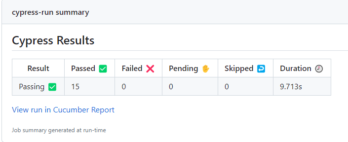

# Github Actions

Create folder **workflows** inside of **.github**

### Create basic.yml

```yaml
name: End-to-end tests
on: push
jobs:
  cypress-run:
    runs-on: ubuntu-22.04
    steps:
      - name: Clear npm cache
        run: npm cache clean --force
      - name: Setup Node
        uses: actions/setup-node@v3
        with:
          node-version: 16.x
      - name: Checkout
        uses: actions/checkout@v3
      # Install npm dependencies, cache them correctly
      # and run all Cypress tests
      - name: Cypress run
        uses: cypress-io/github-action@v5
        with:
          install-command: npm install
          build: npm run build
          start: npm start
```

`install-command: npm install` is used to install devDependencies

### Cucumber reports

Add steps to **generate report** and **upload artifacts** after **Cypress run** step.

```yaml
      - name: Generate report
        if: always()
        continue-on-error: true
        run: npm run cy:report
      - name: Upload report
        if: always()
        uses: actions/upload-artifact@v3
        with:
          name: cypress-cucumber-report
          path: cypress/reports/cucumber-report/
```

Piece of code below preserves that next steps are always execute even **Cypress run** step fails

```yaml
    if: always()
    continue-on-error: true
```

### Workflow job parametrization


#### workflow_dispatch

To enable triggering jobs manually from github actions add to basic.yml file in __on:__ section. Pure workflow_dispatch allow to trigger job with one default branch parameter set to main.

```yaml
on: [workflow_dispatch, push]
```

#### inputs

To enable browser selection modify basic.yaml file in **on:** section by adding inputs browser in type choice

```yaml
on:
workflow_dispatch:
  inputs:
    browser:
      type: choice
        description: Select browser
        default: electron
        options:
          - electron
          - chrome
          - firefox
          - edge

push:
  branches: [main]
```

#### env

add **env:** section to set browser env variable based on the user selection or default

```yaml
env:
BROWSER: ${{ github.event.inputs.browser || 'electron' }}
```

add browser option in **Cypress run** step to run tests in selected browser

```yaml
    - name: Cypress run
      uses: cypress-io/github-action@v5
      with:
        browser: ${{env.BROWSER || 'electron'}}
        install-command: npm install
        build: npm run build
        start: npm start
```

#### cron

to schedule jobs add to **on:** section

```yaml
  schedule:
  - cron: "0 0 * * *"
```

### Deploy report to gh-pages

We can deploy report to gh-pages branch where artifact from last run will be stored performing steps below:

add step __deploy report to gh-pages__ [How GITHUB_TOKEN works](https://dev.to/github/the-githubtoken-in-github-actions-how-it-works-change-permissions-customizations-3cgp)

```yaml
    - name: deploy report to gh-pages
      if: always()
      uses: peaceiris/actions-gh-pages@v3
      with:
        github_token: ${{ secrets.GITHUB_TOKEN }}
        publish_dir: ./cypress/reports/cucumber-report
```

add write permissions

```yaml
jobs:
  cypress-run:
    runs-on: ubuntu-22.04
    permissions:
      contents: write
```

set gh-pages as branch from which Github Page will be deployed


For now our workflow file will trigger pages-build-deplyment job which deploy report from cucumber tests to github pages


### WorkflowJob Summary

We can configure workflow file to display in job summary custom information like: browser or link to the report page

```yaml
    - name: Write summary
      if: always()
      run: |
      echo "- Browser: $BROWSER" >> $GITHUB_STEP_SUMMARY
      echo "- Cucumber report: https://leonardust.github.io/todomvc-cypress/" >> $GITHUB_STEP_SUMMARY
```



### Cucumber for jira

To provide integration with Cucumber for Jira plugin:

add step to workflow file

```yaml
      - name: Push results to jira
        if: always()
        run: |
          curl -X POST https://c4j.cucumber.io/ci/rest/api/results \
          -H "authorization: Bearer ${{ secrets.C4J_TOKEN }}" \
          -H 'content-type: multipart/form-data' \
          -F results_file=@./cypress/reports/cucumber-json/cucumber-report.json \
          -F language=js
```

create repository secret C4J_TOKEN with value provided by Cucumber for Jira plugin in your Jira instance

### Final workflow

```yaml
name: End-to-end tests
on:
  schedule:
    - cron: "0 0 * * *"
  workflow_dispatch:
    inputs:
      browser:
        type: choice
        description: Select browser
        default: chrome
        options:
          - electron
          - chrome
          - firefox
          - edge

  push:
    branches: [main]

env:
  BROWSER: ${{ github.event.inputs.browser || 'chrome' }}

jobs:
  cypress-run:
    runs-on: ubuntu-22.04
    permissions:
      contents: write
    steps:
      - name: Clear npm cache
        run: npm cache clean --force

      - name: Setup Node
        uses: actions/setup-node@v3
        with:
          node-version: 16.x

      - name: Checkout
        uses: actions/checkout@v3

      - name: Cypress run
        uses: cypress-io/github-action@v5
        with:
          browser: ${{env.BROWSER || 'chrome'}}
          install-command: npm install
          build: npm run build
          start: npm start

      - name: Generate report
        if: always()
        continue-on-error: true
        run: npm run cy:report

      - name: Upload report
        if: always()
        uses: actions/upload-artifact@v3
        with:
          name: cypress-cucumber-report
          path: cypress/reports/cucumber-report/

      - name: Deploy report to gh-pages
        if: always()
        uses: peaceiris/actions-gh-pages@v3
        with:
          github_token: ${{ secrets.GITHUB_TOKEN }}
          publish_dir: ./cypress/reports/cucumber-report

      - name: Push results to jira
        if: always()
        run: |
          curl -X POST https://c4j.cucumber.io/ci/rest/api/results \
          -H "authorization: Bearer ${{ secrets.C4J_TOKEN }}" \
          -H 'content-type: multipart/form-data' \
          -F results_file=@./cypress/reports/cucumber-json/cucumber-report.json \
          -F language=js

      - name: Write summary
        if: always()
        run: |
          echo "- Browser: $BROWSER" >> $GITHUB_STEP_SUMMARY
          echo "- Cucumber report: https://leonardust.github.io/todomvc-cypress/" >> $GITHUB_STEP_SUMMARY
```