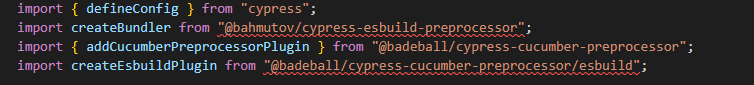
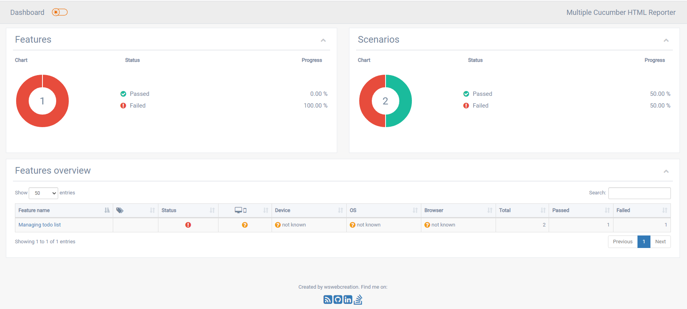

# Cypress, VsCode extensions and Cucumber pre-processor installation and configuration

# Cypress installation and configuration

To install cypress follow _[Cypress - installing cypress](https://docs.cypress.io/guides/getting-started/installing-cypress)_ or perform command below

```sh
npm install cypress --save-dev
```

Install npx package to executes  either from a local node_modules/.bin

```sh
npm install -g npx
```

Create and configure **tsconfig.json** file inside your cypress folder

```json
{
  "compilerOptions": {
    "target": "es5",
    "lib": ["es5", "dom"],
    "types": ["cypress", "node"]
  },
  "include": ["**/*.ts"]
}

```

# VsCode extensions

_[Material Icon Theme](https://marketplace.visualstudio.com/items?itemName=PKief.material-icon-theme)_ - Material Design Icons for Visual Studio Code

_[Prettier](https://marketplace.visualstudio.com/items?itemName=esbenp.prettier-vscode)_ - Code formatter

To add prettier as default formatter add this code to the **settings.json**

```json
"editor.defaultFormatter": "esbenp.prettier-vscode"
```

_[Cucumber (Gherkin) Full Support](https://marketplace.visualstudio.com/items?itemName=alexkrechik.cucumberautocomplete)_

# Cucumber setup

### Install dependencies

1. Install cucumber dependencies follow _[@badeball/cypress-cucumber-preprocesor](https://www.npmjs.com/package/@badeball/cypress-cucumber-preprocessor)_ or execute command below

```sh
npm install --save-dev @badeball/cypress-cucumber-preprocessor
```

According to the _[quick-start.md](https://github.com/badeball/cypress-cucumber-preprocessor/blob/master/docs/quick-start.md#example-setup)_ Replace content of the **cypress.config.ts** file by code below

```ts
import { defineConfig } from "cypress";
import createBundler from "@bahmutov/cypress-esbuild-preprocessor";
import { addCucumberPreprocessorPlugin } from "@badeball/cypress-cucumber-preprocessor";
import createEsbuildPlugin from "@badeball/cypress-cucumber-preprocessor/esbuild";

export default defineConfig({
  e2e: {
    specPattern: "**/*.feature",
    async setupNodeEvents(
      on: Cypress.PluginEvents,
      config: Cypress.PluginConfigOptions
    ): Promise<Cypress.PluginConfigOptions> {
      // This is required for the preprocessor to be able to generate JSON reports after each run, and more,
      await addCucumberPreprocessorPlugin(on, config);

      on(
        "file:preprocessor",
        createBundler({
          plugins: [createEsbuildPlugin(config)],
        })
      );

      // Make sure to return the config object as it might have been modified by the plugin.
      return config;
    },
  },
});

```

In case of errors in **cypress.config.ts** shown below:



Install missing dependencies

```sh
npm install --save-dev @bahmutov/cypress-esbuild-preprocessor
```

and fix import error for `@badeball/cypress-cucumber-preprocessor/esbuild` by adding to **tsconfig.json**

```json
{
  "compilerOptions": {
    "paths": {
      "@badeball/cypress-cucumber-preprocessor/*": ["./node_modules/@badeball/cypress-cucumber-preprocessor/dist/subpath-entrypoints/*"]
    }
  }
}

```

### Configure step definition

Add configuration to the **settings.json**

```json
"cucumberautocomplete.customParameters": [],
"cucumberautocomplete.strictGherkinCompletion": true,
"cucumberautocomplete.steps": ["cypress/support/step_definitions/*.js"]
```

Add configuration to the **package.json**

```json
"cypress-cucumber-preprocessor": {
    "stepDefinitions": "cypress/support/step_definitions/**/*.js"   
}
```

Create stepdefinition folder in **cypress/support/step_definitions/** folder

##### HTML Reports

To create html reports add to the **package.json** in **"cypress-cucumber-preprocessor"** section

```json
"html": {
      "enabled": true,
      "output": "cypress/reports/cucumber-html/cucumber-report.html"
},
"messages": {
      "enabled": true,
      "output": "cypress/reports/cucumber-ndjson/cucumber-report.ndjson"
},
```

##### JSON Reports

To create json reports add to the **package.json** in **"cypress-cucumber-preprocessor"** section

```json
"json": {
      "enabled": true,
      "output": "cypress/reports/cucumber-json/cucumber-report.json"
}
```

#### Multiple Cucumber HTML Report

Install [multiple-cucumber-html-reporter](https://github.com/WasiqB/multiple-cucumber-html-reporter) dependencies

```sh
npm install multiple-cucumber-html-reporter --save-dev
```

Create **multiple-cucumber-report.js** file in cypress/reports/multiple-cucumber-report.js and provide **jsonDir(folder)** where cucumber-report.json is
and specify path to the report folder **reportPath** 

```js
const report = require("multiple-cucumber-html-reporter");

report.generate({
  jsonDir: "./cypress/reports/cucumber-json/",
  reportPath: "./cypress/reports/cucumber-report/",
});
```

Add in script section of **package.json** to generate multiple-cucumber-html-report

```json
"cy:report": "node ./cypress/reports/multiple-cucumber-html-reporter/multiple-cucumber-report.js"
```


